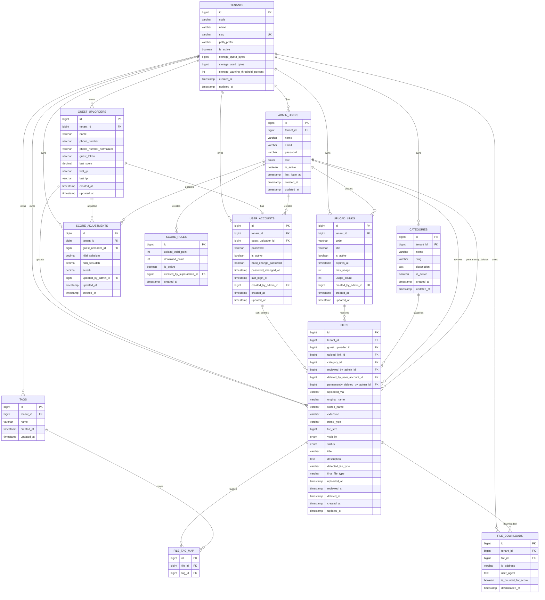
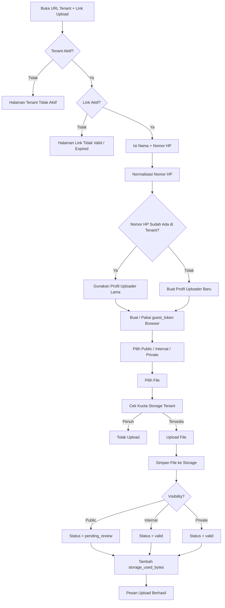
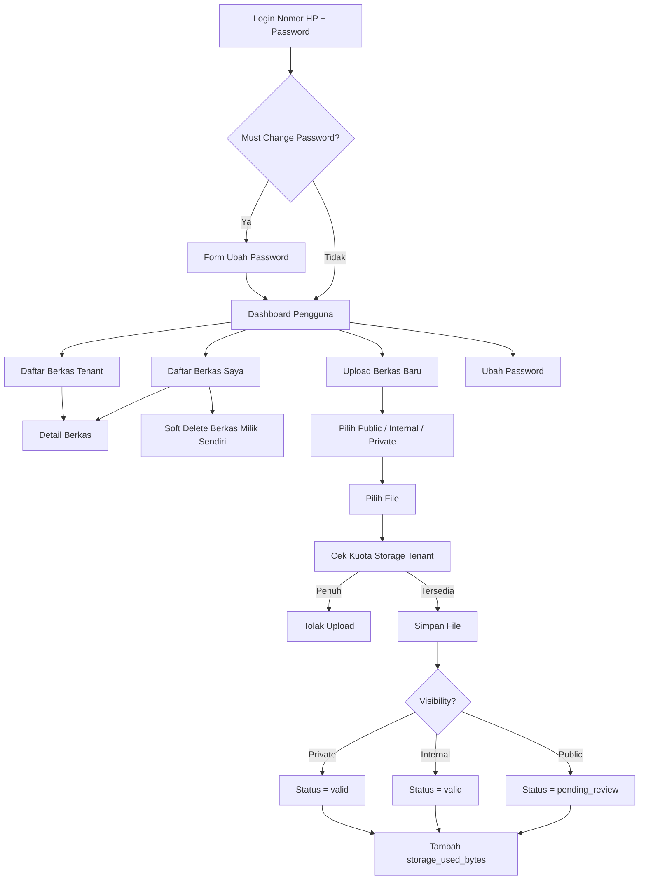
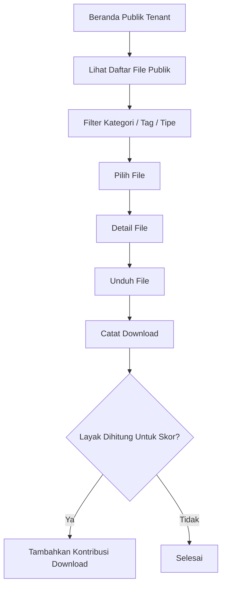
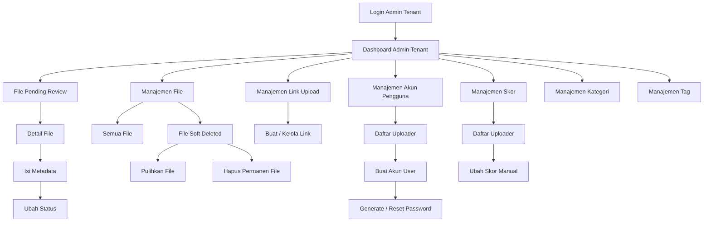
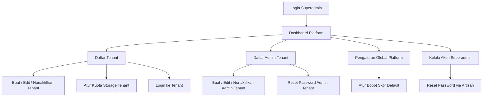
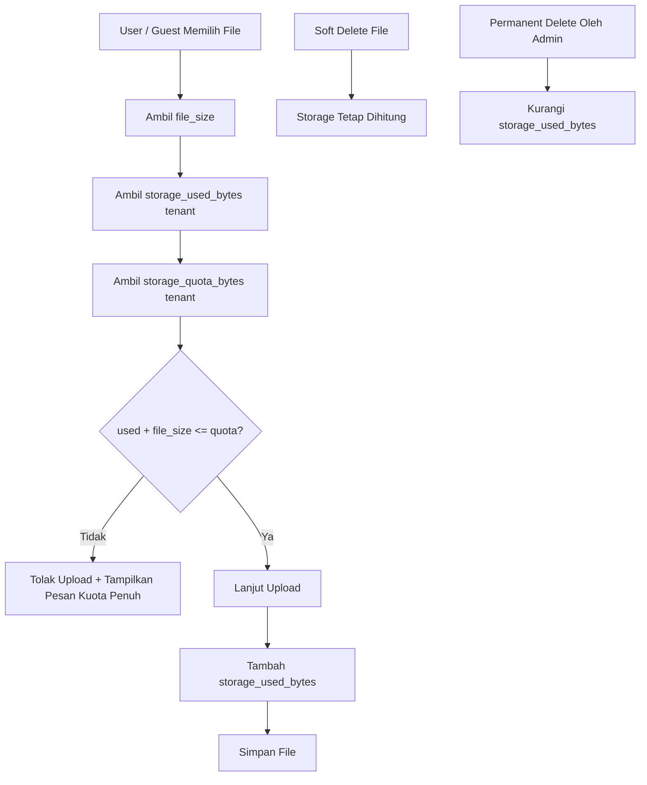

# ERD dan Flow Menu Aplikasi Arsipkan

## 1. Ringkasan Sistem
Aplikasi Arsipkan adalah sistem arsip berkas **multitenant** dengan domain utama:

- `arsipkan.my.id/{tenant_slug}/...`

Setiap organisasi diperlakukan sebagai satu tenant yang memiliki:

- uploader
- akun pengguna uploader
- admin tenant
- link upload
- file
- kategori
- tag
- leaderboard
- batas kuota storage

Sistem memiliki 4 jenis aktor:

- guest uploader
- user uploader
- admin tenant
- superadmin platform

Untuk MVP:

- nomor HP dipakai sebagai identitas login user uploader
- relasi utama antar data memakai `id`
- nomor HP yang sama boleh ada di tenant berbeda
- satu nomor HP mewakili satu uploader di dalam satu tenant
- satu uploader memiliki maksimal satu akun user di tenant yang sama
- pengiriman password dilakukan manual oleh admin
- tidak ada integrasi API eksternal
- tidak ada audit log
- soft delete file dilakukan user uploader, restore/hapus permanen dilakukan admin tenant
- `guest_token` hanya dipakai untuk mengenali browser guest uploader secara ringan

---

## 2. ERD Konseptual

---

## 3. Penjelasan Relasi

### `TENANTS` -> tabel operasional
Semua data inti terikat ke tenant:

- `guest_uploaders`
- `user_accounts`
- `upload_links`
- `files`
- `categories`
- `tags`
- `file_downloads`
- `score_adjustments`
- `admin_users`

### `GUEST_UPLOADERS` -> `USER_ACCOUNTS`
Satu uploader dalam satu tenant dapat memiliki maksimal satu akun pengguna.

### `GUEST_UPLOADERS` -> `FILES`
Satu uploader dapat mengunggah banyak file dalam tenant yang sama.

### `USER_ACCOUNTS` -> `FILES`
User uploader dapat melakukan soft delete pada file miliknya melalui `deleted_by_user_account_id`.

### `UPLOAD_LINKS` -> `FILES`
Satu link upload dapat dipakai oleh banyak file dalam tenant yang sama.

### `CATEGORIES` -> `FILES`
Satu kategori tenant dapat dipakai oleh banyak file tenant.

### `FILES` <-> `TAGS`
Relasi many-to-many melalui `file_tag_map`.

### `FILES` -> `FILE_DOWNLOADS`
Semua unduhan file publik dapat dicatat untuk kebutuhan statistik dan scoring.

### `ADMIN_USERS` -> `USER_ACCOUNTS`
Admin tenant membuat atau reset akun user uploader.

### `ADMIN_USERS` -> `FILES`
Admin tenant:

- mereview file
- memulihkan file soft delete
- menghapus permanen file

### `ADMIN_USERS` -> `SCORE_ADJUSTMENTS`
Admin tenant mengubah skor uploader secara manual.

### `ADMIN_USERS` -> `SCORE_RULES`
Superadmin membuat atau mengubah bobot skor default platform.

---

## 4. Struktur Tabel Inti

## 4.1 `tenants`
Menyimpan data organisasi.

Field penting:

- `slug` dipakai pada URL `arsipkan.my.id/{tenant_slug}`
- `storage_quota_bytes` batas total storage tenant
- `storage_used_bytes` total storage terpakai tenant
- `storage_warning_threshold_percent` ambang peringatan kuota, misalnya 80

Aturan:

- `slug` harus unik
- `slug` tidak boleh bentrok dengan reserved slug sistem

## 4.2 `guest_uploaders`
Menyimpan uploader berdasarkan nomor HP dalam tenant.

Field penting:

- `tenant_id`
- `phone_number_normalized`
- `guest_token`
- `last_score`

Aturan:

- kombinasi `tenant_id + phone_number_normalized` harus unik
- nomor HP yang sama boleh dipakai di tenant lain
- `guest_token` bukan akun login dan bukan relasi utama bisnis

## 4.3 `user_accounts`
Menyimpan akun user uploader.

Field penting:

- `tenant_id`
- `guest_uploader_id`
- `password`
- `is_active`
- `must_change_password`

Aturan:

- nomor HP login diambil dari relasi ke `guest_uploaders`
- kombinasi `tenant_id + guest_uploader_id` harus unik
- `must_change_password = true` saat akun dibuat atau di-reset admin

## 4.4 `upload_links`
Menyimpan link upload yang dibuat admin tenant.

Field penting:

- `tenant_id`
- `code`
- `is_active`
- `expires_at`
- `max_usage`
- `usage_count`

Aturan:

- kombinasi `tenant_id + code` harus unik

## 4.5 `files`
Tabel utama berkas.

Field penting:

- `tenant_id`
- `guest_uploader_id`
- `upload_link_id`
- `category_id`
- `uploaded_via`
- `file_size`
- `visibility`
- `status`
- `deleted_at`
- `deleted_by_user_account_id`
- `permanently_deleted_by_admin_id`

Aturan:

- `status`: `pending_review`, `valid`, `suspended`
- `visibility`: `public`, `internal`, `private`
- file `public` masuk dengan status awal `pending_review`
- file `internal` masuk dengan status awal `valid`
- file `private` masuk dengan status awal `valid`
- soft delete tidak memakai enum `status`
- soft delete diwakili oleh `deleted_at`
- file soft deleted tidak tampil di daftar aktif
- seluruh FK tenant-bound pada `files` harus mengarah ke entitas dengan `tenant_id` yang sama

## 4.6 `categories`
Master kategori tenant.

Aturan:

- kombinasi `tenant_id + slug` harus unik
- kombinasi `tenant_id + name` sebaiknya unik

## 4.7 `tags`
Master tag tenant.

Aturan:

- kombinasi `tenant_id + name` harus unik

## 4.8 `file_tag_map`
Tabel pivot relasi file dengan tag.

## 4.9 `file_downloads`
Log unduhan file publik.

Field penting:

- `is_counted_for_score`

## 4.10 `admin_users`
Tabel user internal.

Nilai `role`:

- `tenant_admin`
- `superadmin`

Aturan:

- jika `role = tenant_admin`, maka `tenant_id` wajib terisi
- jika `role = superadmin`, maka `tenant_id` boleh `NULL`
- email `superadmin` harus unik global
- email `tenant_admin` minimal unik dalam tenant yang sama

## 4.11 `score_rules`
Menyimpan bobot skor default platform.

Contoh:

- upload file valid = 10 poin
- download sah = 1 poin

Aturan:

- tidak ada override bobot skor per tenant pada MVP

## 4.12 `score_adjustments`
Riwayat perubahan skor manual.

Wajib menyimpan:

- `nilai_sebelum`
- `nilai_sesudah`
- `selisih`
- `updated_by_admin_id`
- `updated_at`

---

## 5. Aturan Bisnis Utama

1. URL tenant memakai pola `arsipkan.my.id/{tenant_slug}/...`
2. Guest uploader tidak perlu login.
3. Guest mengisi nama, nomor HP, visibilitas, lalu upload file.
4. Nomor HP dinormalisasi dan unik per tenant.
5. Nomor HP yang sama boleh dipakai di tenant lain.
6. File baru dengan visibilitas `public` otomatis berstatus `pending_review`.
7. File baru dengan visibilitas `internal` otomatis berstatus `valid`.
8. File baru dengan visibilitas `private` otomatis berstatus `valid`.
9. Metadata file hanya diisi Admin Tenant atau Superadmin dalam konteks tenant.
10. User uploader login memakai nomor HP + password.
11. `remember me` aktif default untuk user uploader.
12. Akun user hasil create/reset admin wajib ganti password pada login berikutnya.
13. User uploader dapat melihat:
   - file miliknya sendiri
   - seluruh daftar file `internal` dalam tenant yang sama
14. User uploader dapat soft delete file miliknya sendiri.
15. Admin Tenant dapat memulihkan atau menghapus permanen file yang di-soft delete.
16. File soft deleted tidak dihitung dalam daftar aktif, leaderboard, dan skor sampai dipulihkan.
17. Bobot skor hanya mengikuti pengaturan default platform dari Superadmin.
18. Tenant memiliki kuota storage.
19. Upload baru ditolak jika kuota tenant terlampaui.
20. File soft deleted tetap dihitung ke kuota sampai dihapus permanen.

---

## 6. Flow Menu per Role

## 6.1 Flow Guest Uploader

### Menu/halaman Guest

- halaman tenant
- validasi link upload
- form identitas guest
- form upload file
- halaman sukses upload

---

## 6.2 Flow User Uploader

### Menu User Uploader

- login
- dashboard pengguna
- daftar berkas saya
- daftar berkas tenant
- detail berkas
- upload berkas
- soft delete berkas milik sendiri
- profil / ubah password

---

## 6.3 Flow Pengunjung Publik

### Menu Publik

- beranda publik tenant
- daftar file publik
- detail file publik
- leaderboard tenant

---

## 6.4 Flow Admin Tenant

### Menu Admin Tenant

- dashboard admin
- file pending review
- semua file
- file soft deleted
- restore file
- hapus permanen file
- kategori
- tag
- link upload
- akun pengguna uploader
- skor uploader

---

## 6.5 Flow Superadmin

### Menu Superadmin

- dashboard platform
- tenant
- kuota storage tenant
- admin tenant
- login ke tenant
- pengaturan global platform
- bobot skor default
- akun superadmin

---

## 7. Flow Kuota Storage Tenant

Aturan kuota:

- kuota disimpan dalam byte
- soft delete tetap memakai kuota
- permanent delete baru membebaskan kuota
- peringatan bisa ditampilkan saat mendekati batas, misalnya 80%

---

## 8. Rekomendasi Implementasi Menu

### User Uploader

- `/{tenant_slug}/login`
- `/{tenant_slug}/dashboard`
- `/{tenant_slug}/my-files`
- `/{tenant_slug}/tenant-files`
- `/{tenant_slug}/upload`
- `/{tenant_slug}/profile`

### Admin Tenant

- `/{tenant_slug}/admin`
- `/{tenant_slug}/admin/files`
- `/{tenant_slug}/admin/files/deleted`
- `/{tenant_slug}/admin/upload-links`
- `/{tenant_slug}/admin/users`
- `/{tenant_slug}/admin/categories`
- `/{tenant_slug}/admin/tags`
- `/{tenant_slug}/admin/scores`

### Superadmin

- `/superadmin`
- `/superadmin/tenants`
- `/superadmin/tenants/{id}/quota`
- `/superadmin/admin-users`
- `/superadmin/settings`
- `/superadmin/superadmins`

---

## 9. Kesimpulan

Dokumen ERD dan flow menu ini sekarang mengikuti rancangan MVP final:

- multitenant berbasis path
- nomor HP unik per tenant
- user uploader bisa melihat file milik sendiri dan daftar file tenant
- user uploader bisa soft delete file miliknya
- admin tenant bisa restore atau permanent delete
- kuota storage tenant diatur oleh superadmin
- tanpa audit log
- tanpa integrasi API eksternal

Struktur ini sudah cukup layak dijadikan dasar:

- migration database
- relasi model
- route map
- permission matrix
